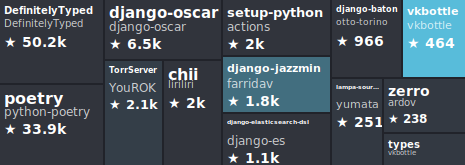

# GitHub Contribution Treemap Generator

<div align="center">
  
</div>

GitHub contributions as an SVG treemap. Built with [d3](https://github.com/d3/d3)

It counts merged PRs you authored across repos, sizes by your contributions, and colors by repo stars.

## Install

```bash
npm i -g @dhvcc/github-contribution-treemap-generator
# for project install, use
npm i @dhvcc/github-contribution-treemap-generator
```

## Quick start (CLI)

```bash
export GITHUB_TOKEN=YOUR_TOKEN
github-contribution-treemap-generator -o treemap.svg
```

- Without `-o`, SVG goes to stdout
- If you don't pass `--username`, it auto-detects from the token

## CLI options

- `-t, --token <token>`: GitHub token (or `GITHUB_TOKEN`)
- `-u, --username <username>`: GitHub username (or `GITHUB_USERNAME`)
- `-o, --output <file>`: Output file (default: stdout)
- `-w, --width <px>`: SVG width (default: 465)
- `--height <px>`: SVG height (default: 165)
- `--exclude-repos <a,b>`: Comma list of repos to exclude (name or `owner/name`)
- `--exclude-owners <a,b>`: Comma list of owners to hide (e.g. orgs)
- `--timeout <ms>`: GitHub API timeout (default: 15000)
- `--github-base-url <url>`: GraphQL base URL (GHE: `https://github.yourco.com/api/graphql`)
- `-q, --quiet`

Env vars:

```text
GITHUB_TOKEN, GITHUB_USERNAME, EXCLUDE_REPOS, EXCLUDE_OWNERS,
WIDTH, HEIGHT, GITHUB_TIMEOUT_MS, GITHUB_BASE_URL, QUIET
```

## Examples

```bash
# Save to file
github-contribution-treemap-generator -t $GITHUB_TOKEN -o treemap.svg

# Custom size
github-contribution-treemap-generator -t $GITHUB_TOKEN -w 800 --height 400 -o treemap.svg

# Hide my org and exclude a repo
github-contribution-treemap-generator -t $GITHUB_TOKEN -H my-org -e owner/repo,another-repo -o treemap.svg

# Print to stdout (pipe to file)
github-contribution-treemap-generator -t $GITHUB_TOKEN > treemap.svg
```

## Use as a library

```ts
import { generateContributionTreemap } from '@dhvcc/github-contribution-treemap-generator';

const svg = await generateContributionTreemap(process.env.GITHUB_TOKEN!, {
  username: 'your-username',
  width: 800,
  height: 400,
  excludeRepos: ['owner/repo', 'name-only'],
  hideOwners: ['some-org'],
});
```

## Notes

- Public data only. A basic token is fine for public repos
- Uses GitHub GraphQL search for merged PRs you authored (`is:pr is:merged author:<you>`)
